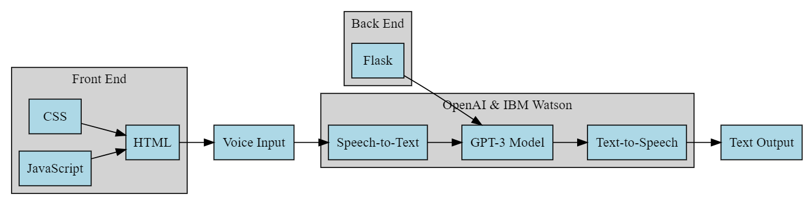

# Voice Assistant with OpenAI's GPT-3 and IBM Watson 🎙️💡

This project aims to create a voice assistant using OpenAI's GPT-3 and IBM Watson technologies. It leverages IBM Cloud IDE environment for seamless development and portable code.
  

---
**Tech Stack:**
- Flask 🌐💻 
- OpenAI's GPT-3 🤖
- IBM Watson 🧠
- Docker for code portability 

#TODO : tomorrow 
+ Project tailoring  
+ Add api code to enable other to use the project 
---